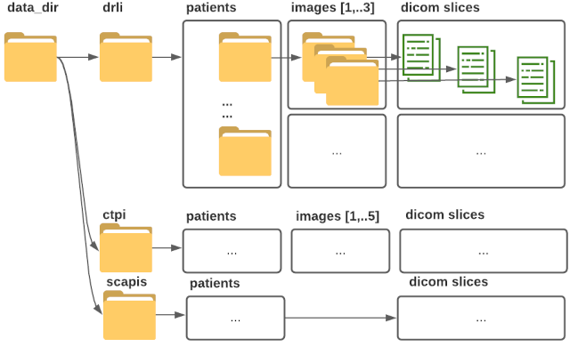

# Medical data markup (DICOM)

Many problems that are difficult to formalize within the framework of classical methods can be solved using artificial neural networks. It is important that for such solutions their application has long been found in various applied areas of life of modern society,
including those related to safety in the field of medical technologies. AI researchers are well aware of the urgent need for a sufficient amount of quality training data (ground truth examples) to train NN, because in fact, the more such data is used in training, the more accurate the model predictions. 
In SCAPIS project, we use different sources of such data. 
One of the main ones is preparing your own data for training based on anonymized images. To facilitate this process, this tool (platform) was developed in our team.
The product is a complementary and updatable tool that uses various deep learning models (currently StyleGan3).

A little bit history. 
One of the most popular formats for storing medical data is **.dcm** files, the internal format of which is specified by the Digital Imaging and Communication in Medicine (DICOM) standard. 
Why is not so simple. 
Support for DICOM formats faces two challenges:
-The DICOM standard implies a huge variety of **.dcm** files.
For example, the standard implies the existence of about 80 [DICOM modalities](https://dicom.innolitics.com/ciods/cr-image/general-series/00080060) that define the content of a DICOM file (CT - computed tomography, CR - radiography, MR - magnetic resonance imaging, etc.). The DICOM standard defines a huge number of different attributes or tags, some universal, others modality-dependent.
Files can also include one image, or multiple (slice), or multiple slices. The data in these images are often not interpreted as pixels, but can determine, for example, the physical values ​​of measurements made by a particular piece of equipment. 
-The DICOM is not the only file format used in medicine. Maintaining all of these scenarios would be an overwhelming task for our team. The process of developing new features in the platform is based on what our users / AI developers need in the first place. 
Here prepared a small, "quick" solution to the problem of DICOM files markup in the platform.
So,  we used **pydicom** module for working with DICOM to prepare a script that converts DICOM files into ordinary images and writes to a binary format with subsequent annotations and the possibility of reverse recovery.

## What’s included as an available datasets:

| What | Description | Patients/ Slices| Copy rights|
| ------- | ------- | ------- |------- |
| **[CTPI - Computed Tomography Pulmonary Angiography data](https://datahub.aida.scilifelab.se/10.23698/aida/ctpa)** | This is a train and testing dataset consisted of image of Lung CT from different patients.  |30 patients 29827 slices|2019 Uppsala University, Tobias Sjöblom, Nyköpings Lasarett, Tomas Fröding |
| **[DRLI - Liver data from the Visual Sweden project DROID](https://datahub.aida.scilifelab.se/10.23698/aida/drli)** | This is a clinical examinations showed CT liver malignancies. Manual oncological annotations were made by a radiologist and these were controlled by a second experienced radiologist. All changes with a diameter greater than 5mm were segmented and assumed metastases  |76 patients 29827 slices|2019 Linköping University, Anders Persson|
| **[SCAPIS]()** | This is a medical dataset from Göteborg university.  |25 patient with 10657 slices  | ?????|

## Preview

The above data are organized in the following order:

In the future, when expanding the functionality, the new obtained medical datasets must be unzipped in the order shown in the figure above.