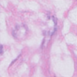

## Quick Sart

The first working implementation of the tool is possible just naive command line, reading parameters from some parameters script file or directly from the command line.

>ATTENTION. The final interface will have changes depending on the accumulated experience of users, recommendations and additional functionality.
```
python main.py -data_dir "D:/Scapis/SCAPIS_Processed_Data" - data_set ctpi 
```
### Load Data
The first argument **data_dir** is the root directory with the source files. The second **ctpi** is the name of data with which plan to work. 

----------------------------------------
	[0]	Download DCOM images from [drli,ctpa,scapis] into the Dictionary and create JSON:
	[1]	Save Dictionary into Numpy and CSV:
	[2]	Load Dictionary from Numpy and CSV:
	[3]	Plot random Slices:
	[4]	Show slices Info:
	[5]	Hounsfield Units (HU):
	[6]	OpenGL show in 3D:
	[7]	Generate Images by PCGAN:
	[8]	Exit:
----------------------------------------
	Choose your option: 

If originally any binary and annotated data were not generated than is highly recommended to start with downloading existing slices as DICOM images from the selected directory.
To do this the user must press 0 in the command line.  and Choose the a desired dataset from the suggested lists, like in the example.

    Choose your option: 0
	    Do you want to load [drli,ctpa,scapis] ? Choose- [0..2]: 0
>Note: The script performs a recursive search for DICOM file. The directory structure is preserved as a result.

    Patient: 0
	    Image 0 slices 704
		Image 1 slices 1
		Image 2 slices 1
	Patient: 1
		Image 0 slices 960
		Image 1 slices 1
		Image 2 slices 1
	Patient: 2
		Image 0 slices 793
    ....
    Patient: 9
		Image 0 slices 938
		Image 1 slices 1
		Image 2 slices 1
    Patient Dict done
    Directory json already created
>Note: This structure saved into the text file in *Json* format located in **json/** project's folder.
 ```python
patient_dict[i]                         # is a number of patient in the dataset 
patient_dict[i]["id"]                   # is a patient ID (patient name) in the dataset
patient_dict[i]["path"]                 # is the full path to the patient's images
patient_dict[i]["image"]           # is a sorted number of images
patient_dict[i]["image"][J]        # is a number of slices in the images sorted by **Instance_Number**
 ```
>Note: This file will created or modified as the following.
> 
    E:\Liu_projects\SCAPIS_AIDA\json\drli_info.json created at Mon Nov 15 13:04:55 2021
>Note: When ready, using **pidicom** library will load the dicom structure, a recursive search for files in the directory is carried out according to the recorded structure. 
> 
 ```python
patient_slices[i].append([pydicom.dcmread(patients_path[-1] + '/' + s) for s in l])
```
    Patient Dict check start
    Patient size 10 Patient 0 Image 0 getSlices 704
    Patient size 10 Patient 0 Image 1 getSlices 1
    Patient size 10 Patient 0 Image 2 getSlices 1
    Patient size 10 Patient 1 Image 0 getSlices 960
    Patient size 10 Patient 1 Image 1 getSlices 1
    Patient size 10 Patient 9 Image 0 getSlices 938
    Patient size 10 Patient 9 Image 1 getSlices 1
    Patient size 10 Patient 9 Image 2 getSlices 1
    Patient Dict check done
>Note: To show slices info type 4
> ...
> ...
### Prepare and convert Data

To use chosen dataset in training process of the selected GAN need to transform data into the binary format and extract all useful information into the annotation file by chosen the option 1.
Unfortinatelly, the use of GAN not supporting the initial resolution of the dataset for now. So, to user will be suggest to rescale the initial dataset into 2, 4, or 8 times by choosing 64 meens (64x64), 128 (128x128)or 256(256x256) image resolution.  
     
    Choose your option: 1
	    Do you want to RESCALE source images? Choose- [64, 128, 256]: 256
	    Rescale 256
    Pars dict...
    10
    3 (704, 256, 256) 704 46137344

>Note: All data slices staks togerther side by side and make a single **.npy** binary file in np project's folder.
 
    Dict: Patients: 3 Shape: (8500, 256, 256) Num of Slices: 8500
>Note: At the same time the annotation file with all necessary information is saved or modified in two **.csv** files, like in the following example:


| Attributes | Tags,hex | Group, hex| Description|
| ------- | ------- | ------- |------- |
|**[Study ID](https://dicom.innolitics.com/ciods/12-lead-ecg/general-study/00200010)**  | 0020 | 0010 | |
|Patient |  |  | The number of patient in the dictionary|
|Image |  |  | The number of image of the patient in the dictionary|
|Slices |  |  | The number of Slice in the image of the patient in the dictionary|
|**[Exposure](https://dicom.innolitics.com/ciods/digital-x-ray-image/x-ray-generation/00181152)** | 0018 | 1152 | The exposure expressed in mAs|
|**[Rows](https://dicom.innolitics.com/ciods/rt-dose/image-pixel/00280010)** | 0028 | 0010 | Original number of rows in the image|
|**[Columns](https://dicom.innolitics.com/ciods/rt-dose/image-pixel/00280011)**  | 0028 | 0011  | Original number of rows in the image|
|**[Pixel Spacing](https://dicom.innolitics.com/ciods/rt-dose/image-plane/00280030)**  | 0028 | 0030  | Physical distance in the patient between the center of each pixel, specified by a numeric pair - adjacent row spacing (delimiter) adjacent column spacing in mm.|
|**[Instance Number](https://dicom.innolitics.com/ciods/mr-image/general-image/00200013)**  | 0020 | 0013  | Image ID|
|**[Acquisition Number](https://dicom.innolitics.com/ciods/surface-scan-mesh/scan-procedure/00200012)**  | 0020 | 0012  | A number identifying the single continuous gathering of data over a period of time that resulted in this Instance.|
|**[Slice locations](https://dicom.innolitics.com/ciods/ct-image/image-plane/00201041)**  | 0020 | 1041  | Relative position of the image plane expressed in mm.|
|**[Body part](https://dicom.innolitics.com/ciods/ct-image/image-plane/00201041)**  | 0018 | 0015  | The part of the body examined|

>Note. Others dataset characteristics like:
> Acquisition_Number, Patient Name, Pationt Sex, Age, StudyDescription, TransferSyntaxUID, MediaStorageSOPClassUID etc, are loaded into the dictionary but not saved into the annotation. Becouse, this informations are not so important to train NN for now.

### Load Data into the model

To load converted dataset from the binary format for following preprocessing press 2.

    Choose your option: 2
	    Do you want to load [drli,ctpa,scapis] dataset ? Choose- [0..2]: 0
    drli
    CSV to Dict...
       StudyID  Patient  Image  ...  Acquisition_Number  SliceLocation  Body_Part
    0  AI-DRLI-001        0      0  ...                   7        -1120.9   DT COLON
    1  AI-DRLI-001        0      0  ...                   7        -1090.8   DT COLON
    2  AI-DRLI-001        0      0  ...                   7        -1030.6   DT COLON
    3  AI-DRLI-001        0      0  ...                   7         -986.5   DT COLON
    4  AI-DRLI-001        0      0  ...                   7        -1305.0   DT COLON

    [5 rows x 12 columns]
    Numpy to Dict...
    ----------------------------------------
    	Dict: Patients: 3 Shape: (8500, 256, 256) Num of Slices: 8500
    ----------------------------------------
The tool will check the availability of annotation and image data and load them into memory if they exist.
    
    Choose your option: 2
	    Do you want to load [drli,ctpa,scapis] dataset ? Choose- [0..2]: 1
    ctpa
    CSV to Dict...
    Unable to load "E:\Liu_projects\SCAPIS_AIDA\csv\ctpa.csv".  Check if its exist. 
    Numpy to Dict...
    Unable to load "E:\Liu_projects\SCAPIS_AIDA\np\ctpa.npy".  Check that it exists. 

### Show Slices Info

>Note: This option has been removed for now. Since many people have said that this is not necessary as it duplicates the annotation.

### Plot Random Slices

This is an additional option, which help user to plot and save figure as pdf into the project's folder. To run it press 3.

| **[Castomized plot](../Customed_Plot.pdf)**

### To plot Slices as 3D shape

>Note: This option has been removed for now. Since that this is a console tool.
 
### Generate Images by PCGAN

To generate annonimized images using pretrained GAN choose option 7 and sellect how many images to generate.
>Note: The number of generated images is currently limited to 1000.

    ----------------------------------------
    Choose your option: 7
		Enter number of images to generate in range [0,..., 999]: 200

>Note: It is important to install tf version '1.15.0'. If its not corresponding than the tool require some magic work to make generation without any critical error.

    Labels dimension = 1
    Saving results to results\000-camelyon-fake-images
    Generating png 0 / 200...
    2021-11-21 16:50:55.572789: I tensorflow/stream_executor/platform/default/dso_loader.cc:44] Successfully opened dynamic library cublas64_100.dll
    2021-11-21 16:50:55.950476: I tensorflow/stream_executor/platform/default/dso_loader.cc:44] Successfully opened dynamic library cudnn64_7.dll
    2021-11-21 16:50:57.275237: W tensorflow/stream_executor/cuda/redzone_allocator.cc:312] Internal: Invoking ptxas not supported on Windows
    Relying on driver to perform ptx compilation. This message will be only logged once.
    Generating png 1 / 200...
    Generating png 2 / 200...
    Generating png 199 / 200...
    Exiting...

The generated images whould be located incide the *results* in the automatically generated folder. 



